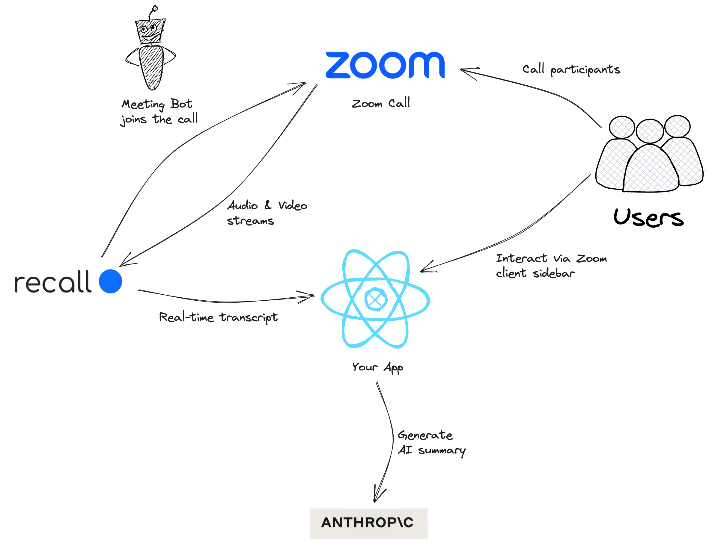

# Zoom Apps AI Assistant Tutorial

### Introduction

Zoom Apps are a great way to extend the Zoom experience and add additional functionality to your meetings. 
In this tutorial, we'll walk through how to build a simple AI assistant Zoom App that uses [Recall.ai](https://recall.ai) to perform transcription and [Anthropic.ai](https://antropic.ai) to generate summaries.

In this guide we will walk through the how to build an AI assistant Zoom App from scratch.
Including how to:

 - Create a Zoom App
 - Setup a backend to receive real-time meeting data
 - Integrate with [Recall.ai](https://recall.ai) to perform transcription
 - Integrate with [Anthropic.ai](https://antropic.ai) to generate summaries
 - Setup a frontend to display transcripts and summaries

We will use the following technologies to build our app:

 - React for the frontend
 - Express/Node.js for the backend

### Context

In order to receive this data, a meeting bot has to join the call and process the data.
Historically, building apps which interact with meeting data in real-time has been a challenge.
This is because of the infrastructure required to build and maintain the bot.

In this demo we will showcase how simple has become to build a Zoom App which can interact with meeting data in real-time and provide value to your users.
Using Recall.ai, we are able to perform transcription on the meeting data in real-time and retrieve the transcript via a webhook using a simple API.

Likewise, providing tangible value from meeting data has also been difficult.
But with the advent of foundational model API's, such as Anthropic's Claude, it has never been easier to make use of meeting data.

### Architecture



Our Zoom App is hosted on public domain which is shown in the Zoom app sidebar.
During a Zoom call, the user can open our app and start recording a live transcript of the call.
After the call is complete they can view the transcript and generate a summary of the call.

Behind the scenes, the transcript is powered by Recall.ai, who provides a simple API to send a meeting bot to the call and retrieve the transcript in real-time.
We then wrap that transcript in a prompt and send that to Antropic's Claude API to generate a summary.

Finally we display that summary back to the end-user in the Zoom app sidebar.

### The Code

The main parts of the code is interacting with Recall.ai and Anthropic.ai to generate our AI summaries.

In order to get the transcript, we must tell Recall.ai to send a bot to the meeting:

```js
router.post('/start-recording', session, async (req, res, next) => {
    try {
        sanitize(req);
        validateAppContext(req);

        // We need the meeting invite link so the bot can join the call
        if (!req.body.meetingUrl) {
            return res.status(400).json({ error: 'Missing meetingUrl' });
        }

        // We then send a request to Recall.ai to send a bot to the meeting
        const bot = await recallFetch('/api/v1/bot', {
            method: 'POST',
            body: JSON.stringify({
                bot_name: 'AI Notetaker',
                meeting_url: req.body.meetingUrl,
                transcription_options: {
                    provider: 'default',
                },
                real_time_transcription: {
                    destination_url: `${zoomApp.publicUrl}/webhook/transcription?secret=${zoomApp.webhookSecret}`,
                    partial_results: true,
                },
                zoom: {
                    request_recording_permission_on_host_join: true,
                    require_recording_permission: true,
                },
            }),
        });

        // Finally we store the botId in the session so we can retrieve the transcript later
        req.session.botId = bot.id;

        return res.json({
            botId: bot.id,
        });
    } catch (e) {
        next(handleError(e));
    }
});
```

We then need an endpoint to capture and store the transcript in real-time.
We have the following webhook which receives the transcript:

```js
router.post('/transcription', async (req, res, next) => {
    try {
        sanitize(req);

        // Authenticate the webhook request
        if (!crypto.timingSafeEqual(Buffer.from(req.query.secret, 'utf8'), Buffer.from(zoomApp.webhookSecret, 'utf8'))) {
            return res.status(401).json({ error: 'Unauthorized' });
        }

        // Retrieve the transcript data
        const { bot_id, transcript } = req.body.data;

        // Save the transcript to a database
        // (we use a simple in-memory database for this demo)
        if (!db.transcripts[bot_id]) {
            db.transcripts[bot_id] = [];
        }

        db.transcripts[bot_id].push(transcript);

        res.status(200).json({ success: true });
    } catch (e) {
        next(handleError(e));
    }
});

```

Next is the code required to generate the summary using Anthropic's Claude API:

```js
// We have a library of prompts that a user can choose from
const PROMPTS = {
    // Our template prompt sets the tone for the conversation
    _template: `
Human: You are a virtual assistant, and you are taking notes for a meeting. 
You are diligent, polite and slightly humerous at times.
Human: Here is the a transcript of the meeting, including the speaker's name:

Human: <transcript>
{{transcript}}
Human: </transcript>

Human: Only answer the following question directly, do not add any additional comments or information.
Human: {{prompt}}

Assistant:`,
    // Here are a few example prompts
    general_summary: 'Can you summarize the meeting? Please be concise.',
    action_items: 'What are the action items from the meeting?',
    decisions: 'What decisions were made in the meeting?',
    next_steps: 'What are the next steps?',
    key_takeaways: 'What are the key takeaways?',
};

/*
 * Gets a summary of the transcript using Anthropic's Claude model.
 */
router.post('/summarize', session, async (req, res, next) => {
    try {
        sanitize(req);
        validateAppContext(req);

        // Retrieve the current bot and selected prompt
        const botId = req.session.botId;
        const prompt = PROMPTS[req.body.prompt];

        if (!botId) {
            return res.status(400).json({ error: 'Missing botId' });
        }

        if (!prompt) {
            return res.status(400).json({ error: 'Missing prompt' });
        }

        // Retrieve the transcript from the database
        const transcript = db.transcripts[botId] || [];

        // Convert the structered transcript into a textual prompt
        const finalTranscript = transcript
            .filter((utterance) => utterance.is_final)
            .map(
                (utterance) =>
                    `Human: ${utterance.speaker || 'Unknown'}: ${utterance.words
                        .map((w) => w.text)
                        .join(' ')}`
            )
            .join('\n');
        const completePrompt = PROMPTS._template
            .replace('{{transcript}}', finalTranscript)
            .replace('{{prompt}}', prompt);


        // Send the prompt to Anthropic's Claude API
        const data = await anthropicFetch('/v1/complete', {
            method: 'POST',
            body: JSON.stringify({
                model: 'claude-2',
                prompt: completePrompt,
                max_tokens_to_sample: 1024,
            }),
        });

        // Return the summary to the user
        return res.json({
            summary: data.completion,
        });
    } catch (e) {
        next(handleError(e));
    }
});
```

Finally we use React to display the transcript and summary to the user.


### Conclusion

In this tutorial we walked through how to build a simple AI assistant Zoom App using Recall.ai and Anthropic.ai.

The full sample code can be found [here](https://github.com/recallai/zoom-bot-demo/).

We hope this tutorial was helpful and we look forward to seeing what you build with Zoom Apps!

